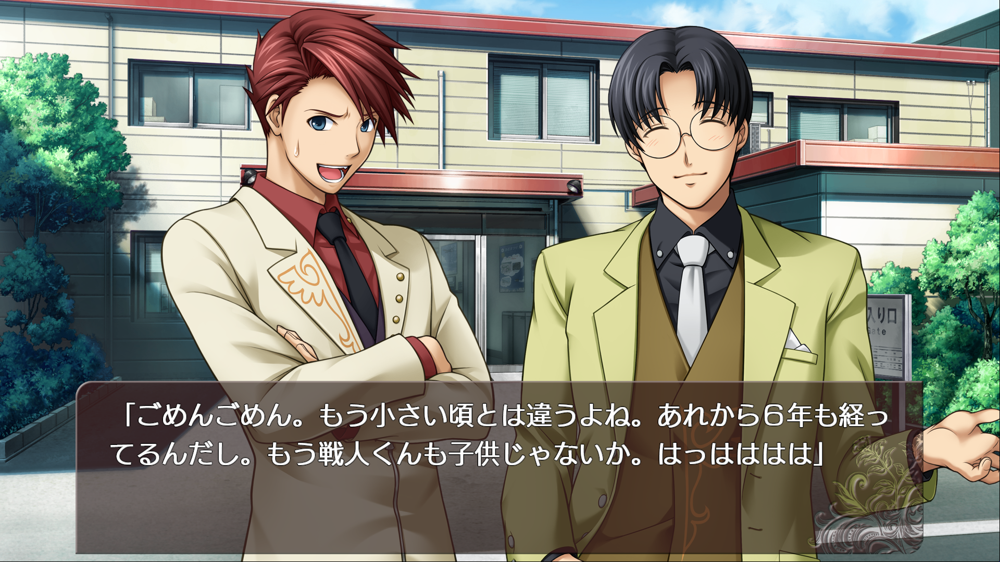

This is an attempt at re-implementation of game engine used by some [visual novels](https://en.wikipedia.org/wiki/Visual_novel) released by [Entergram](http://www.entergram.co.jp/) on Nintendo Switch, PS4 and PS Vita.

Known Switch games include:
- Higurashi no Naku Koro ni Hou (title id `0100F6A00A684000`)
- D.C.4 \~Da Capo 4\~ (title id `0100D8500EE14000`)
- Gensou Rougoku no Kaleidoscope (title id `0100AC600EB4C000`)
- Kono Subarashii Sekai ni Shukufuku wo! Kibou no Meikyuu to Tsudoishi Boukenshata Plus (title id `01004920105FC000`)
- Umineko no Naku Koro ni Saku \~Nekobako to Musou no Koukyoukyoku\~ (title id `01006A300BA2C000`)
- Sugar*Style (title id `0100325012B70000`)
- Sakaagari Hurricane Portable (title id `0100A680151A0000`)

Known PS Vita games include:
- Higurashi no Naku Koro ni Sui (title id `PCSG00517`)
- Shirogane x Spirits! (title id `PCSG00846`)
- Rep Kiss (title id `PCSG00906`)
- Sakaagari Hurricane Portable (title id `PCSG00990`)
- Amaekata wa Kanojo Nari ni. (title id `PCSG01086`)
- Kimi no Hitomi ni Hit Me (title id `PCSG01087`)
- Soi Kano \~Gyutto Dakishimete\~ (title id `PCSG01254`)

If you know more - let me know! (`dcnick3` on Discord)

## Status

The initial implementation is focused on running switch version of Umineko no Naku Koro ni Saku \~Nekobako to Musou no Koukyoukyoku\~ (title id `01006A300BA2C000`), with the intention to support other games in the future.

As of writing, most of the basic game functionality works:
- Character sprites
- Backgrounds
- BGM & SFX
- Text

However, there are still a lot of missing advanced features. It's not fully playable yet.

The intent is to follow the engine as closely as possible, so that it can be used to run the original games.




## Try it

You can try out the engine by downloading a pre-built binary from the [releases](https://github.com/dcnick3/shin/releases) page.

Select the latest release, and download the `shin` archive for your platform and extract it somewhere.

Then you would need to have romfs of Umineko no Naku Koro ni Saku \~Nekobako to Musou no Koukyoukyoku\~ game (title id `01006A300BA2C000`).

It can be dumped from the switch using [nxdumptool](https://github.com/DarkMatterCore/nxdumptool).

You can use [hactoonet](https://github.com/Thealexbarney/LibHac) to dump the romfs from the game:

```bash
hactoolnet -t pfs0 "Umineko no Naku Koro ni Saku ~Nekobako to Musou no Koukyoukyoku~ [01006A300BA2C000].nsp" --romfs=assets
```

In the `assets` directory you should find a `data.rom` file. It's sha256sum should be `6d90eb0bacacf769a7e4634407622b047acd711c47debb28136d7bab3fd0e591`.

You can put then put the `assets` directory next to the executable or another location documented [here](https://dcnick3.github.io/shin/shin/asset/locate/fn.locate_assets.html)

Then you try running the game.

Controls are:
- Mouse click, space, enter - advance text
- Ctrl - fast-forward text
- Escape, Q - quit
- F3 - show overlay menu
- F10 - resize to 1080p
- F11 - toggle fullscreen

If you encounter any problems, please open an [issue on GitHub](https://github.com/DCNick3/shin/issues).

## Docs

While there is no comprehensive documentation of the engine, as I reverse engineer it, I try to document the findings mainly in [this spreadsheet](https://docs.google.com/spreadsheets/d/1BGGZ1Wjnx5FXgjDjhKgwhRxSAY_HYX_6U0q679IVUi8/edit?usp=share_link)

The autogenerated docs can be found [here](https://dcnick3.github.io/shin/shin/).

## What else is in the box

Aside from the game engine, this repo also includes `shin-core` - a library for working with the game data.

There is also `sdu` - a CLI interface for the `shin-core` library. It can be used to extract game data, and to convert it to other more conventional formats.

You can download it from the [releases](https://github.com/dcnick3/shin/releases) page.

For now, we have support for extracting the following data:
- `.rom` - Game data archive
- `.bup` - Character sprites
- `.pic` - Backgrounds & CGs
- `.nxa` - Game audio
- `.snr` - Limited support for game scenario (no decompilation, only tracing the execution)
- `.fnt` - Font data
- `.txa` - Texture archives (used mostly for UI)

Support for other formats used is planned.

If you encounter any errors/problems when using the CLI - please open an [issue on GitHub](https://github.com/DCNick3/shin/issues).

## Building from source

To build from source you would need to have [Rust](https://www.rust-lang.org/) installed.

Then you can build the engine with:

```bash
cargo build --release -p shin
```

And run it with:

```bash
cargo run --release -p shin
```
